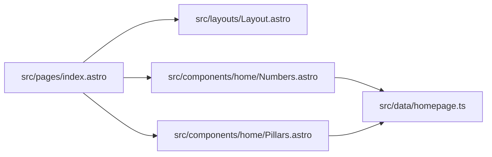

# Sample Outputs

## Purpose

Show what the system should produce in practice for `zentala.eu`.

These examples are illustrative but grounded in the current repository structure.

## 1. Snapshot Summary

```json
{
  "project": {
    "name": "zentala.eu",
    "branch": "main"
  },
  "summary": {
    "routeCount": 34,
    "componentCount": 29,
    "diagnosticCount": 0,
    "testCount": 4,
    "hotspotCount": 5,
    "orphanCandidateCount": 6
  }
}
```

## 2. Hotspot Finding

```json
{
  "id": "hotspot-homepage-fanout",
  "kind": "refactor",
  "severity": "medium",
  "title": "Homepage has high dependency fan-out",
  "paths": ["src/pages/index.astro"],
  "evidence": {
    "fanOut": 12,
    "publicSurface": true,
    "sharedDataSource": "src/data/homepage.ts"
  },
  "recommendation": "Reduce orchestration pressure and verify key homepage sections."
}
```

## 3. Orphan Candidate

```json
{
  "id": "orphan-preview-route",
  "kind": "investigate",
  "severity": "low",
  "title": "Preview route may be weakly connected to production flow",
  "paths": ["src/pages/resources/preview/homepage.astro"],
  "evidence": {
    "incomingLinks": 0,
    "zone": "preview"
  },
  "recommendation": "Review whether the preview route is still needed or should remain internal-only."
}
```

## 4. Work Queue

```json
[
  {
    "priority": 87,
    "type": "refactor",
    "title": "Review homepage composition pressure",
    "paths": ["src/pages/index.astro"],
    "reason": "public route, high fan-out, central data dependency"
  },
  {
    "priority": 82,
    "type": "test",
    "title": "Increase verification for critical public routes",
    "paths": ["src/pages/support.astro", "src/pages/benefits.astro"],
    "reason": "user-facing routes with limited confidence signals"
  },
  {
    "priority": 58,
    "type": "investigate",
    "title": "Review preview-only and weak-reach files",
    "paths": ["src/pages/resources/preview/homepage.astro"],
    "reason": "low product reach, possible cleanup candidate"
  }
]
```

## 5. File Analysis Output

Example for `src/pages/index.astro`:

```json
{
  "path": "src/pages/index.astro",
  "kind": "route",
  "metrics": {
    "fanOut": 12,
    "diagnosticCount": 0,
    "riskScore": 82
  },
  "dependsOn": [
    "src/layouts/Layout.astro",
    "src/components/Hero.astro",
    "src/components/home/Numbers.astro",
    "src/components/home/Pillars.astro",
    "src/components/home/Benefits.astro"
  ],
  "findings": [
    "high dependency fan-out",
    "public route",
    "shared homepage data coupling"
  ],
  "suggestedActions": [
    "stabilize section contracts",
    "review route-level verification",
    "track homepage coupling trend across snapshots"
  ]
}
```

## 6. Compare Report

```text
Compared to previous snapshot:
- diagnostics: 0 -> 0
- homepage fan-out: 10 -> 12
- orphan candidates: 8 -> 6
- public route confidence: unchanged
- new dependency cycles: 0
```

## 7. Markdown Summary for Humans

```md
# Analysis Summary

## Top Priorities

1. Review homepage composition pressure
2. Increase verification for critical public routes
3. Review preview-only files for cleanup

## Notable Improvements

- orphan candidate count decreased
- no new diagnostics introduced

## Risks

- homepage coupling continues to grow
```

## 8. Mermaid Output



## Why These Outputs Matter

They improve:

- agent grounding
- developer prioritization
- refactor confidence
- onboarding speed
- architecture review quality
